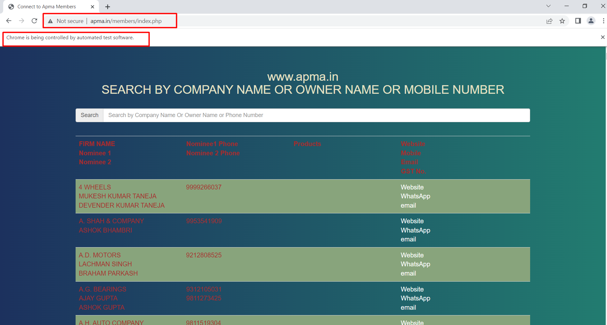
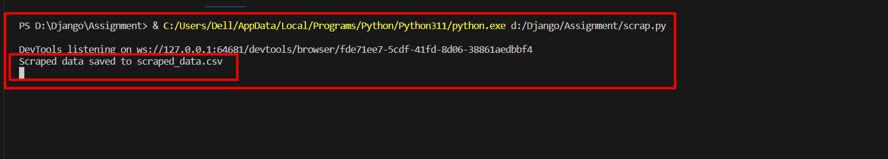

# SCRAP USING THE BEAUTIFUL SOUP MODULE AND CHROME DRIVER AND  STORE THE LEADS DATA IN A CSV FILE.

  * Install all packages
    * beautifulsoup4 4.12.2
    * selenium 4.10.0
    * csv23 0.3.4
    * ChromeDriver 114.0.5735.90 

  * This page Auto opens after running this program don't do anything just wait
  

  *  Don't do anything You still wait in the Terminal section

  
     

